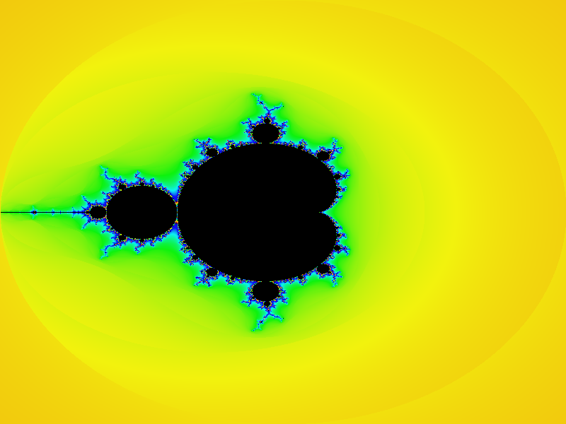

Kotlin Fractals Hand On
=======================

The hands-on labs project to demonstrate and learn how to
create an Kotlin Multiplatform project (MPP) with Kotlin/JVM
and Kotlin/JS

That project is pure Kotlin/JVM project (only now, we will turn
it to use a multiplatform project (MPP) to combine JVM and JS very soon)
that renders a fractal images and serves results as a HTTP Web Server. For example, 

### Running 

Open the `build.gradle.kts` project file in IntelliJ IDEA as project. 
Execute the `run` task to compile and start the application. 
See the image on the http://127.0.0.1:8888 in the browser 

Once started, use `jsRun` task to execute the JS part in the
web browser.

